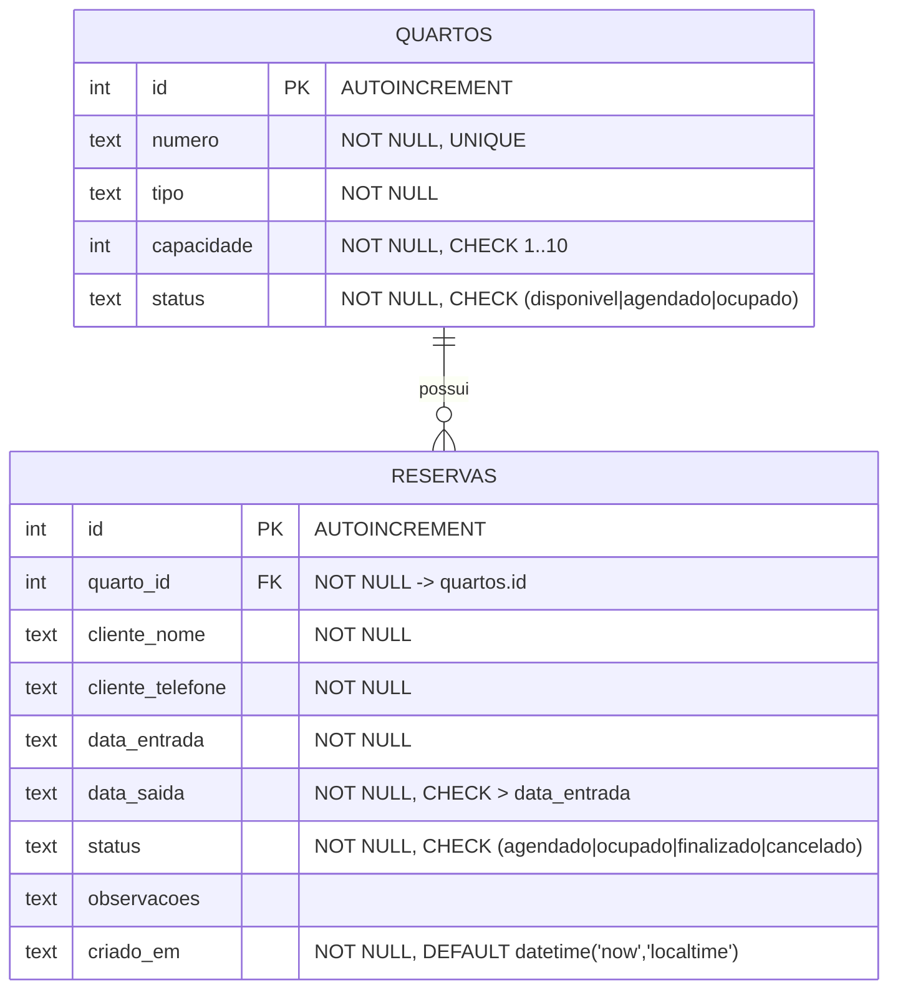
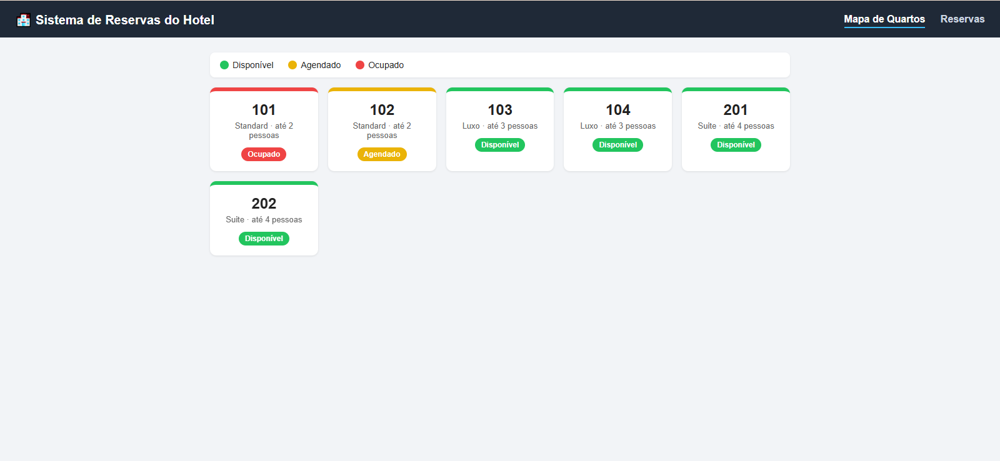
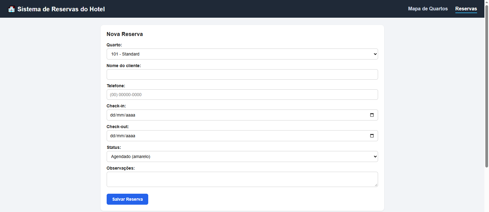
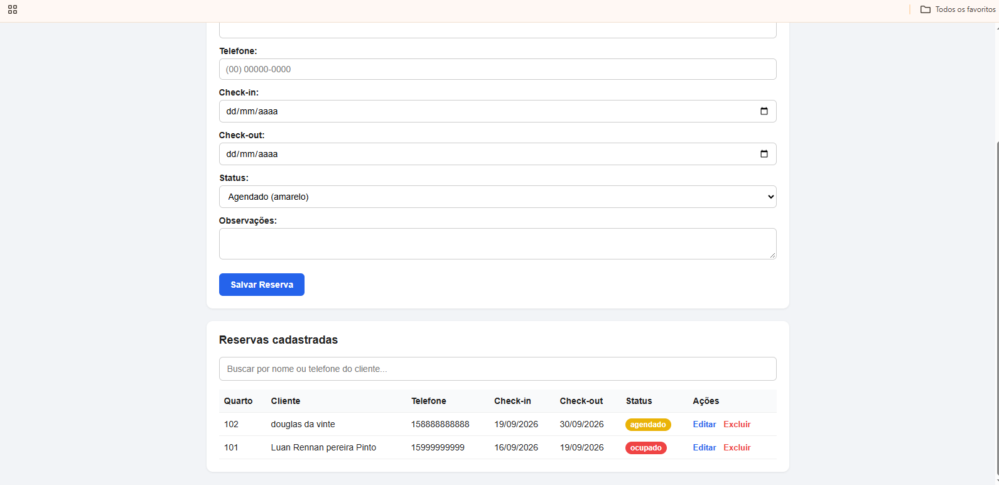

# Sistema de Reserva de Hotel

Trabalho de **Banco de Dados — NP1**

---

## 1. Identificação Institucional

- **Curso:** Análise e Desenvolvimento de Sistemas (ADS)
- **Instituição:** Universidade Paulista (UNIP) — Campus Sorocaba-SP
- **Disciplina:** Banco de Dados
- **Turma:** DS4Q17

### Integrantes

| Nome completo | RA |
|---|---|
| Eduardo Vieira Garcia | H31BIA7 |
| Vinicius de Pádua de Frati Bertoni | H75CEG3 |
| Mauricio Pereira Reis Cunha | H124J5 |
| Luan Rennan Pereira Pinto | G145HI0 |

---

## 2. Descrição do Projeto

Sistema de controle manual de reservas para um pequeno hotel. O cliente entra em contato diretamente com o proprietário (telefone, WhatsApp) e o próprio proprietário registra a reserva no sistema. Não há área de cliente nem reserva feita pela internet: o sistema é uma ferramenta interna de operação.

A tela principal é um **mapa visual dos quartos**, em que a cor indica a situação de cada um: verde para disponível, amarelo para agendado (já existe reserva marcada, mas o cliente ainda não chegou) e vermelho para ocupado (o cliente já está no quarto). A cor é atualizada automaticamente sempre que uma reserva é criada, editada ou excluída.

### Escopo funcional

O sistema tem duas telas. O **Mapa de Quartos** mostra a situação visual de todos os quartos e permite alterar o status de um quarto direto pelo card. A tela de **Reservas** concentra o CRUD completo das reservas (criar, listar, editar e excluir), com busca por nome ou telefone do cliente.

O cadastro dos quartos é feito uma única vez, na carga inicial do banco (`db/schema.sql`), já que o número de quartos de um hotel não muda no dia a dia.

### Regras de negócio

1. Cada quarto tem número (único), tipo (Standard, Luxo ou Suíte), capacidade de 1 a 10 pessoas e um status.
2. Uma reserva pertence a exatamente um quarto, através da chave estrangeira `quarto_id`.
3. A data de check-out precisa ser posterior à data de check-in. A regra é garantida em três camadas: no navegador, no PHP e por uma restrição `CHECK` na própria tabela.
4. **Um quarto não pode ter duas reservas ativas no mesmo período.** A sobreposição é detectada pela condição `data_entrada < :saida AND data_saida > :entrada`. Reservas finalizadas ou canceladas não bloqueiam a agenda.
5. O status da reserva define a cor do quarto: agendado deixa o quarto amarelo, ocupado deixa vermelho, finalizado e cancelado devolvem o quarto para verde.
6. Ao excluir ou finalizar uma reserva, o status do quarto é **recalculado** a partir das reservas ativas restantes, e não simplesmente marcado como disponível. Isso evita que um quarto com outra reserva válida volte a aparecer como livre.
7. O nome do cliente precisa ter ao menos 3 caracteres e o telefone precisa ter 10 ou 11 dígitos (DDD + número).

---

## 3. Modelagem de Dados

### Diagrama Entidade-Relacionamento (DER)



**Cardinalidade:** um quarto possui zero ou muitas reservas; uma reserva pertence a exatamente um quarto (1:N).

### Normalização

O modelo está na **3ª Forma Normal**. Todos os atributos são atômicos (1FN); as tabelas têm chave primária simples e nenhum atributo depende parcialmente da chave (2FN); e não existe dependência transitiva entre atributos não-chave (3FN). Dados do quarto, como tipo e capacidade, não são repetidos dentro de `reservas` — a tela de reservas busca essa informação por `INNER JOIN`, não por coluna duplicada.

### Integridade

| Mecanismo | Onde | O que garante |
|---|---|---|
| `PRIMARY KEY` | `quartos.id`, `reservas.id` | Identificação única de cada registro |
| `FOREIGN KEY` | `reservas.quarto_id → quartos.id` | Integridade referencial |
| `UNIQUE` | `quartos.numero` | Não existem dois quartos com o mesmo número |
| `CHECK` | `quartos.status`, `reservas.status` | Só valores previstos pelo domínio |
| `CHECK` | `quartos.capacidade` | Capacidade entre 1 e 10 |
| `CHECK` | `reservas.data_saida > data_entrada` | Período de estadia coerente |
| `NOT NULL` | campos obrigatórios | Nenhum registro incompleto |
| `PRAGMA foreign_keys = ON` | `src/conexao.php` | No SQLite as FKs vêm **desativadas** por padrão; o PRAGMA é executado em toda conexão |
| `beginTransaction / commit / rollBack` | `public/api.php` | Reserva e status do quarto são gravados juntos ou nenhum dos dois |

### Script DDL

O script completo está em [`db/schema.sql`](db/schema.sql).

---

## 4. Guia de Instalação e Execução

### Pré-requisitos

Apenas **PHP 8.0 ou superior** com a extensão `pdo_sqlite` (já vem habilitada por padrão nas instalações oficiais do PHP). Não é necessário instalar SGBD, Composer, Node ou qualquer dependência externa.

Para conferir se o PHP está instalado e com o driver certo:

```bash
php -v
php -m | findstr sqlite     # Windows
php -m | grep sqlite        # Linux / macOS
```

A saída do segundo comando deve incluir `pdo_sqlite`.

### Passo a passo

```bash
# 1. Clonar o repositório
git clone https://github.com/luanrennanb15/crudFaculdade.git
cd crudFaculdade

# 2. Subir o servidor embutido do PHP apontando para a pasta public/
php -S localhost:8000 -t public

# 3. Abrir no navegador
#    http://localhost:8000/index.html     -> mapa de quartos
#    http://localhost:8000/reservas.html  -> CRUD de reservas
```

O banco `db/hotel.db` **não está versionado** e é criado automaticamente na primeira requisição, a partir de `db/schema.sql`, já com 6 quartos de exemplo. O repositório é reprodutível a partir do clone limpo, sem nenhum passo manual de configuração.

Para recomeçar do zero, basta apagar `db/hotel.db` e recarregar a página.

---

## 5. Estrutura do Projeto

```
crudFaculdade/
├── db/
│   └── schema.sql          # Script DDL: tabelas, restrições, índices e dados iniciais
├── src/
│   └── conexao.php         # Conexão PDO com o SQLite (sem ORM)
├── public/                 # Raiz do servidor web
│   ├── index.html          # Mapa de quartos (verde/amarelo/vermelho)
│   ├── reservas.html       # CRUD de reservas
│   ├── api.php             # Camada de dados: SQL direto via PDO
│   ├── estilo.css          # CSS puro
│   └── script.js           # JavaScript puro (fetch)
├── docs/                   # Capturas de tela (evidências)
├── .gitignore
└── README.md
```

### Rotas da API (`public/api.php`)

| Método | Rota | Operação SQL |
|---|---|---|
| GET | `?acao=listar_quartos` | SELECT |
| POST | `?acao=atualizar_status_quarto` | UPDATE |
| GET | `?acao=listar_reservas` | SELECT com INNER JOIN |
| POST | `?acao=criar_reserva` | INSERT + UPDATE (em transação) |
| POST | `?acao=atualizar_reserva` | UPDATE + UPDATE (em transação) |
| POST | `?acao=excluir_reserva` | DELETE + UPDATE (em transação) |

Todas as consultas usam **prepared statements** com parâmetros nomeados (`prepare` / `execute`), o que elimina a possibilidade de SQL Injection.

---

## 6. Restrições Técnicas Atendidas

| Exigência do trabalho | Como foi atendida |
|---|---|
| SGBD permitido | **SQLite** |
| Linguagem de back-end permitida | **PHP** |
| Sem framework no back-end | PHP puro. Nenhum Laravel, Symfony, Slim ou similar |
| Sem ORM | Conexão via **PDO nativo**, todo o SQL escrito à mão. Nenhum Eloquent ou Doctrine |
| Front-end na pilha padrão | HTML5, CSS3 e **JavaScript puro** |
| Sem framework SPA | Nenhum React, Angular ou Vue. Navegação por páginas HTML comuns |
| Sem dependências externas | Não há `composer.json` nem `package.json`. Zero bibliotecas de terceiros |

---

## 7. Evidências Visuais

### Mapa de quartos

Situação dos quartos com as cores refletindo o status armazenado no banco.



### Tela de cadastro de reserva

Formulário de criação de reserva (operação **Create**).



### Reservas cadastradas

Listagem das reservas persistidas (operações **Read**, **Update** e **Delete**).



### Persistência no banco de dados

`PREENCHER: print do arquivo db/hotel.db aberto no DB Browser for SQLite, mostrando as linhas das tabelas quartos e reservas.`
